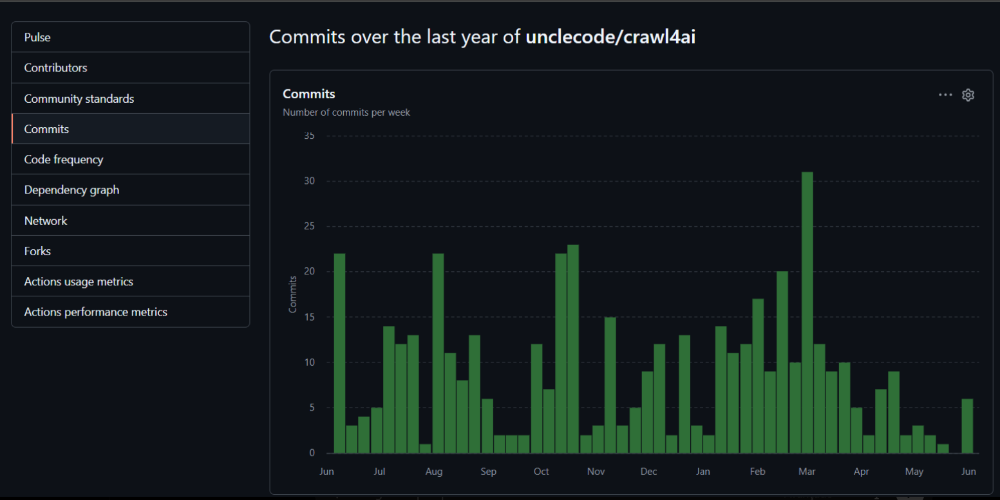

# Eixo A: O Pulso da Gestão (MPS.BR - GPR)

O Eixo A utiliza o MPS.BR, especialmente a área de Gerência de Projetos (GPR), como referência para avaliar a maturidade da gestão do projeto Crawl4AI. A análise observa se issues, Pull Requests, riscos técnicos, revisões e entregas possuem planejamento, rastreabilidade, acompanhamento e critérios claros de controle.

Dessa forma, o objetivo não é apenas verificar problemas técnicos no código, mas entender como esses problemas são gerenciados pelo projeto.

---

## 1. Arqueologia de Issues — Issue #399

A issue analisada foi a **Issue #399 — “Error using crawler: maximum recursion depth exceeded”**, do projeto Crawl4AI. Ela foi escolhida por apresentar uma falha real em ambiente Docker, envolvendo erro de recursão, consumo de memória, processos zumbis e dúvidas sobre gerenciamento de instâncias do navegador.

---

### 1.1 Conexão com a Atividade 1

| Item | Análise |
|---|---|
| Evidência da A1 | Na Atividade 1, a equipe identificou que o Crawl4AI possui entregas rápidas e boa organização técnica, mas ainda apresenta limitações na gestão formal, principalmente no uso de milestones, ausência de GitHub Projects/Kanban e falta de acompanhamento administrativo mais visível. |
| Conexão com a Issue #399 | A Issue #399 aprofunda esse achado, pois mostra uma falha crítica sendo tratada principalmente nos comentários da issue, sem evidência clara de milestone, PR vinculado, teste de regressão ou critério formal de aceite. |
| Diagnóstico | O caso mostra que o projeto possui boa resposta técnica aos usuários, mas ainda depende de uma gestão informal para tratar problemas de estabilidade. |
| Classificação de risco | Alto |
| Recomendação | Issues críticas devem ser vinculadas a uma milestone, receber label específica, ter critério de aceite e acompanhamento após o fechamento. |

---

### 1.2 Por que a Issue #399 foi escolhida?

| Item | Análise |
|---|---|
| Pergunta analisada | Por que essa issue foi escolhida para a arqueologia de issues? |
| Evidência | [Issue #399 — Error using crawler: maximum recursion depth exceeded](https://github.com/unclecode/crawl4ai/issues/399) |
| Diagnóstico | A issue foi escolhida porque apresenta uma discussão real entre usuários e mantenedor sobre uma falha com possível impacto em produção. O erro `maximum recursion depth exceeded` ocorreu durante o uso do crawler em Docker, em um cenário de execução recorrente. |
| Classificação de risco | Alto |
| Recomendação | Usar essa issue como exemplo de incidente crítico de estabilidade, pois ela permite analisar abertura, discussão, ampliação de escopo, documentação da solução e relatos posteriores de persistência do problema. |

---

### 1.3 Quem abriu a issue?

| Item | Análise |
|---|---|
| Pergunta analisada | Quem abriu a issue e qual era o problema inicial? |
| Evidência | A issue foi aberta por `@betterthanever2`, em 1º de janeiro de 2025: [abertura da Issue #399](https://github.com/unclecode/crawl4ai/issues/399#issue-2765066645) |
| Diagnóstico | O autor relatou erro de recursão em uma aplicação executada em Docker. Ele explicou que havia dois processos recorrentes: um executado a cada 1 hora e outro a cada 1 minuto. Isso indica que o problema apareceu em um cenário de uso contínuo, semelhante a produção, e não apenas em um teste isolado. |
| Classificação de risco | Alto |
| Recomendação | Issues abertas com contexto de produção devem receber labels como `docker`, `memory`, `stability` ou `incident`, pois podem afetar a disponibilidade do sistema. |

---

### 1.4 Como foi a discussão nos comentários?

| Item | Análise |
|---|---|
| Pergunta analisada | Como foi a discussão nos comentários? |
| Evidência 1 | Outro usuário relatou o mesmo erro e informou ter identificado mais de 2000 processos zumbis: [comentário sobre processos zumbis](https://github.com/unclecode/crawl4ai/issues/399#issuecomment-2567322807) |
| Evidência 2 | O autor alertou que o problema poderia consumir toda a memória do servidor: [comentário sobre consumo de memória](https://github.com/unclecode/crawl4ai/issues/399#issuecomment-2567361031) |
| Evidência 3 | O mantenedor respondeu dizendo que a implementação Docker ainda estava em fase de testes e seria reescrita com foco em escalabilidade: [comentário do mantenedor sobre Docker e escalabilidade](https://github.com/unclecode/crawl4ai/issues/399#issuecomment-2567630844) |
| Diagnóstico | A discussão foi ativa e técnica. O problema deixou de ser um caso individual quando outro usuário confirmou sintomas semelhantes e relatou processos zumbis. A resposta do mantenedor mostra atenção ao problema, mas também revela que a implementação Docker ainda não estava madura para uso intenso em produção. |
| Classificação de risco | Alto |
| Recomendação | Quando mais de um usuário confirma uma falha crítica, a issue deveria ser vinculada a uma milestone ou a uma tarefa de correção acompanhável. Também seria adequado usar labels específicas para estabilidade, Docker e memória. |

---

### 1.5 Houve mudança ou ampliação de escopo?

| Item | Análise |
|---|---|
| Pergunta analisada | Houve mudança de escopo no meio do caminho? |
| Evidência 1 | O autor mostrou o código usado e comentou que não encontrou documentação clara sobre gerenciamento de instâncias do navegador: [comentário sobre gerenciamento de instâncias do navegador](https://github.com/unclecode/crawl4ai/issues/399#issuecomment-2567647151) |
| Evidência 2 | O mantenedor sugeriu uma solução usando `crawler.start()`, reaproveitamento do navegador, processamento em batches e controle de memória: [comentário com solução usando `crawler.start()` e batches](https://github.com/unclecode/crawl4ai/issues/399#issuecomment-2575162904) |
| Diagnóstico | Sim. A issue começou como um erro de recursão, mas a discussão passou a envolver consumo de memória, processos zumbis, uso do Docker, gerenciamento de instâncias do Chrome, documentação e escalabilidade. Isso mostra que o problema inicial estava ligado a questões técnicas e operacionais maiores. |
| Classificação de risco | Alto |
| Recomendação | Quando uma issue amplia seu escopo, o ideal é criar subtarefas ou issues derivadas. Neste caso, poderiam existir tarefas separadas para memória/processos zumbis, documentação do uso correto em Docker e melhoria da escalabilidade. |

---

### 1.6 Como a solução foi documentada?

| Item | Análise |
|---|---|
| Pergunta analisada | Como a solução foi documentada? |
| Evidência 1 | A solução foi explicada pelo mantenedor em comentário, com exemplo usando `crawler.start()` e batches: [comentário com solução técnica proposta](https://github.com/unclecode/crawl4ai/issues/399#issuecomment-2575162904) |
| Evidência 2 | O autor confirmou que, após refatorar a aplicação, não observou problemas de memória por algumas horas: [comentário de validação manual do autor](https://github.com/unclecode/crawl4ai/issues/399#issuecomment-2578676739) |
| Evidência 3 | Depois, outros usuários voltaram a relatar sintomas semelhantes ou persistência do problema: [relato posterior de sintomas semelhantes](https://github.com/unclecode/crawl4ai/issues/399#issuecomment-3007936316) e [relato posterior de persistência do problema](https://github.com/unclecode/crawl4ai/issues/399#issuecomment-3057648757) |
| Diagnóstico | A solução foi documentada principalmente nos comentários da issue. Houve orientação técnica do mantenedor e validação manual do usuário, mas não foram identificadas evidências claras de PR vinculado, teste de regressão, milestone ou critério formal de aceite. Como surgiram relatos posteriores de sintomas semelhantes, há indício de que o fechamento não foi acompanhado por validação formal suficiente. |
| Classificação de risco | Alto |
| Recomendação | Antes de fechar issues críticas, o projeto deveria exigir critério de aceite, teste de regressão, versão afetada, versão corrigida e confirmação de que o erro não ocorre em ambiente semelhante ao relatado. |

---

### 1.7 Como ocorreu o fechamento da issue?

| Item | Análise |
|---|---|
| Pergunta analisada | A issue foi fechada com documentação suficiente? |
| Evidência | O fechamento/encaminhamento da issue aparece associado ao comentário do mantenedor sobre a implementação Docker ainda estar em fase de testes e sobre a necessidade de reescrita com foco em escalabilidade: [comentário do mantenedor sobre Docker e escalabilidade](https://github.com/unclecode/crawl4ai/issues/399#issuecomment-2567630844) |
| Diagnóstico | O fechamento não apresentou, de forma visível, um critério formal de aceite, um PR associado ou um teste de regressão que comprovasse a correção definitiva do problema. A existência de comentários posteriores indicando persistência ou sintomas semelhantes reforça que a issue pode ter sido encerrada com base em orientação técnica e validação manual, e não em uma verificação formal do projeto. |
| Classificação de risco | Alto |
| Recomendação | Para issues críticas, o fechamento deveria ocorrer somente após critérios objetivos: reprodução do erro, correção documentada, teste de regressão, versão afetada, versão corrigida e acompanhamento pós-fechamento. |

---

### 1.8 Síntese da Arqueologia de Issues

| Item | Resultado |
|---|---|
| Issue analisada | [Issue #399 — Error using crawler: maximum recursion depth exceeded](https://github.com/unclecode/crawl4ai/issues/399) |
| Ponto positivo observado | A issue mostra que o Crawl4AI possui comunidade ativa e mantenedor responsivo. Os usuários relataram problemas reais, compartilharam contexto técnico e receberam orientação do mantenedor. |
| Principal problema encontrado | A gestão do problema ficou concentrada nos comentários da issue. Não foram identificadas evidências claras de PR vinculado, milestone, teste de regressão ou critério formal de aceite. |
| Diagnóstico geral | A Issue #399 evidencia fragilidade na gestão formal de problemas críticos. Embora tenha havido resposta técnica, a rastreabilidade entre problema, solução, validação e fechamento ficou incompleta. |
| Classificação geral de risco | Alto |
| Recomendação geral | Tratar falhas desse tipo como incidentes técnicos, com label própria, milestone, critério de aceite, teste automatizado de regressão, registro da versão corrigida e acompanhamento após o fechamento. |

#### Fechamento da seção

A análise da Issue #399 reforça problemas já observados na Atividade 1. O Crawl4AI demonstra boa resposta técnica e interação ativa com a comunidade, mas ainda apresenta fragilidade na gestão formal de issues críticas.

A falha foi discutida nos comentários e recebeu orientação técnica, porém não foram identificadas evidências claras de PR vinculado, milestone, teste de regressão ou critério formal de aceite.

Assim, o principal risco está na possibilidade de problemas de estabilidade em produção serem tratados de forma reativa e informal, dificultando o acompanhamento da correção e a prevenção de recorrências.

---

## 2. Gestão de Riscos Ocultos

Na Atividade 1, a equipe já havia identificado que o Crawl4AI possui mecanismos para reduzir erros em saídas com IA, como schemas, JSON, CSS/XPath e regex. Porém, também foi observado que não existe uma validação automática completa para garantir que todo conteúdo gerado por LLM esteja semanticamente fiel à página original.

Nesta etapa, a investigação buscou identificar riscos ocultos no código por meio de TODOs, FIXMEs, trechos comentados e mecanismos ligados à instabilidade de APIs de IA.

---

### 2.1 Os TODOs, FIXMEs ou trechos comentados revelam riscos técnicos negligenciados?

| Evidência | Diagnóstico / Análise crítica | Classificação de risco | Recomendação |
|---|---|---|---|
| [TODO em `extraction_strategy.py`](https://github.com/unclecode/crawl4ai/blob/7259d734a1eb8bd9e5504ca6971de43db5255c3d/crawl4ai/extraction_strategy.py#L633) | Foi identificado um TODO em uma área ligada à estratégia de extração do projeto. O comentário indica que existe uma melhoria planejada para definir propriedades dinamicamente com base na assinatura do método `__init__`. Como esse arquivo está relacionado às estratégias de extração, incluindo uso de LLMs, a pendência aparece em uma parte sensível do sistema. Isso revela uma dívida técnica parcialmente negligenciada, pois a melhoria está registrada apenas como comentário no código, sem evidência clara de issue associada, responsável, prioridade ou prazo de correção. | Médio | Transformar esse TODO em uma issue rastreável no GitHub, com descrição do impacto, responsável, prioridade e versão-alvo. Também é recomendável documentar melhor a evolução dessa parte da API interna. |
| [FIXME em `async_logger.py`](https://github.com/unclecode/crawl4ai/blob/7259d734a1eb8bd9e5504ca6971de43db5255c3d/crawl4ai/async_logger.py#L211) | Foi encontrado um FIXME no sistema de logs. O comentário informa que mensagens com formatação numérica podem causar problemas na aplicação correta de cores e caixas no logger. Embora pareça um problema visual, logs são importantes para diagnóstico de falhas em produção. Em um sistema que depende de crawling, execução assíncrona, rede e APIs externas, problemas de log podem dificultar a identificação da causa real de erros. | Médio | Corrigir o tratamento de mensagens formatadas no logger e adicionar testes específicos para valores numéricos formatados, como `{value:.2f}`. Isso melhora a observabilidade do sistema. |

#### Conclusão

Sim. Os TODOs e FIXMEs encontrados revelam riscos técnicos parcialmente negligenciados. Eles mostram que a equipe conhece algumas pendências, mas essas pendências ainda aparecem apenas como comentários no código.

O principal problema gerencial é a falta de rastreabilidade formal desses riscos, já que não há evidência clara, nesses trechos, de issue associada, prioridade, responsável ou prazo de resolução.

---

### 2.2 Como o time lida com a instabilidade das APIs de IA, como timeouts, rate limits ou mudanças de versão?

| Evidência | Diagnóstico / Análise crítica | Classificação de risco | Recomendação |
|---|---|---|---|
| [Tratamento de `RateLimitError` em `utils.py`](https://github.com/unclecode/crawl4ai/blob/7259d734a1eb8bd9e5504ca6971de43db5255c3d/crawl4ai/utils.py#L1816) | A presença de tratamento para `RateLimitError` mostra que o projeto reconhece o risco de instabilidade em provedores de IA. APIs externas podem falhar por excesso de requisições, instabilidade temporária, erro de autenticação ou alteração de comportamento do provedor. Esse tratamento indica que a equipe tenta responder a falhas de limite de uso, mas ainda é uma mitigação parcial, pois depende de mensagens claras, configuração correta e testes específicos. | Médio, com mitigação parcial | Padronizar o tratamento de falhas de LLM, separando erros de rate limit, timeout, autenticação, resposta inválida e falha de provedor. Isso facilitaria o diagnóstico pelo usuário e pela equipe. |
| [`backoff_base_delay` em `LLMConfig`](https://github.com/unclecode/crawl4ai/blob/7259d734a1eb8bd9e5504ca6971de43db5255c3d/crawl4ai/async_configs.py#L2038), [`backoff_max_attempts`](https://github.com/unclecode/crawl4ai/blob/7259d734a1eb8bd9e5504ca6971de43db5255c3d/crawl4ai/async_configs.py#L2039) e [`backoff_exponential_factor`](https://github.com/unclecode/crawl4ai/blob/7259d734a1eb8bd9e5504ca6971de43db5255c3d/crawl4ai/async_configs.py#L2040) | Os parâmetros de backoff em `LLMConfig` indicam que o projeto permite configurar tentativas e intervalos de espera quando chamadas a LLM falham. Isso é uma boa prática para lidar com instabilidade temporária de APIs externas. Porém, o risco não é eliminado, apenas reduzido, porque o sistema continua dependente do comportamento dos provedores de IA e da configuração correta desses parâmetros. | Médio, com mitigação parcial | Criar testes de regressão simulando rate limit, timeout, erro de autenticação e resposta inválida. Também seria recomendável centralizar esse comportamento em uma camada única de tratamento de falhas de LLM. |

#### Conclusão

O time lida com a instabilidade das APIs de IA de forma parcialmente adequada. O código possui tratamento para `RateLimitError` e parâmetros de backoff configuráveis em `LLMConfig`, o que mostra preocupação com falhas externas e repetição controlada de chamadas.

Porém, essa solução não elimina o risco, pois APIs de IA continuam sujeitas a timeout, limite de uso, mudanças de versão e alterações no formato das respostas.

---

### 2.3 Síntese da Gestão de Riscos Ocultos

| Aspecto analisado | Síntese |
|---|---|
| Riscos ocultos encontrados | Foram encontrados comentários do tipo TODO e FIXME em arquivos do código principal. |
| Os riscos são negligenciados? | Parcialmente. Os comentários mostram que a equipe reconhece os problemas, mas nem sempre há rastreabilidade formal por issue, prioridade, responsável ou prazo. |
| Tratamento de APIs de IA | O projeto possui mecanismos de mitigação, como `RateLimitError` e parâmetros de backoff no `LLMConfig`. |
| Limitação principal | O risco é reduzido, mas não eliminado. O sistema continua dependente de provedores externos de IA e de configuração adequada. |
| Recomendação geral | Converter pendências técnicas em issues rastreáveis e fortalecer testes para falhas de APIs externas, especialmente timeout, rate limit, erro de autenticação e mudança de versão. |
| Classificação geral de risco | Médio. |

#### Fechamento da seção

A gestão de riscos ocultos do Crawl4AI pode ser considerada parcialmente madura. O projeto possui mecanismos técnicos para lidar com instabilidades de APIs de IA, mas ainda mantém dívidas técnicas registradas apenas como comentários no código.

O risco geral foi classificado como médio, pois não representa uma falha imediata, mas pode afetar manutenção, observabilidade e confiabilidade em ambiente de produção.

---

## 3. Ritmo de Entrega

### 3.1 O projeto teve picos de “crunch” ou uma cadência constante?

#### Evidência 1 — Gráfico de commits do último ano

#### Diagnóstico

A análise do gráfico de commits do último ano mostra que o Crawl4AI possui atividade recorrente, mas não apresenta uma cadência totalmente constante. Existem semanas com poucos commits e outras semanas com concentração maior de alterações, especialmente próximo de fevereiro e março, onde aparece um dos maiores picos do período analisado.

Esse comportamento indica que o projeto não está abandonado e possui continuidade de desenvolvimento. Porém, os picos visíveis no gráfico sugerem momentos de maior intensidade de trabalho, possivelmente ligados à preparação de releases, correções acumuladas ou integração de funcionalidades.

Assim, o ritmo de entrega pode ser considerado ativo, mas irregular, com sinais de “crunch” em alguns períodos.

#### Classificação de risco

Risco médio.

O risco é médio porque o projeto demonstra atividade frequente, mas a concentração de commits em algumas semanas pode aumentar a chance de alterações serem integradas com menor tempo de revisão ou validação.

#### Recomendação

Recomenda-se acompanhar o ritmo de entrega por ciclos menores, usando milestones, planejamento semanal e acompanhamento dos Pull Requests abertos. Isso ajudaria a reduzir a concentração excessiva de mudanças em poucas semanas e tornaria o processo de entrega mais previsível.

---

### 3.2 Os Pull Requests também mostram concentração de entregas?

| Evidência | Diagnóstico | Classificação de risco | Recomendação |
|---|---|---|---|
| Lista de Pull Requests mergeados. Link da busca usada no GitHub: [busca de PRs mergeados no GitHub](https://github.com/unclecode/crawl4ai/pulls?q=is%3Apr+is%3Amerged+sort%3Aupdated-desc)  Foram observados vários PRs mergeados em datas próximas:  - 24 de abril: #1934, #1901, #1929, #1925, #1845, #1922 - 29 de março: #1885, #1882 - 24 de março: #1844, #1849, #1851, #1836 - Semana anterior à análise: #1960, #1967, #1969, #1975 | A lista de Pull Requests mergeados reforça a conclusão obtida no gráfico de commits. Foram observados vários PRs integrados em datas muito próximas, principalmente em 24 de abril e 24 de março. Isso indica que parte das entregas ocorre em blocos, e não de maneira totalmente distribuída ao longo do tempo. Essa concentração não significa necessariamente falta de gestão, pois o projeto é ativo e recebe contribuições com frequência. No entanto, quando muitos PRs são integrados no mesmo dia, existe maior risco de revisões apressadas, conflitos entre alterações e dificuldade de rastrear qual mudança causou determinado problema depois da integração. | Risco médio. O risco é médio porque a concentração de merges pode indicar acúmulo de trabalho, principalmente em períodos próximos a releases ou correções importantes. | Recomenda-se distribuir melhor os merges ao longo do ciclo de desenvolvimento, evitando acumular muitas integrações em um mesmo dia. Também seria importante usar milestones de forma mais consistente, separando correções críticas, melhorias pequenas e novas funcionalidades. |

---

### 3.3 Há evidências de Code Review nos Pull Requests?

| Evidência | Diagnóstico | Classificação de risco | Recomendação |
|---|---|---|---|
| PR #1934 — revisão técnica antes do merge.  Pull Request analisado: [PR #1934](https://github.com/unclecode/crawl4ai/pull/1934)  Comentário do mantenedor pedindo alteração: [comentário do mantenedor no PR #1934](https://github.com/unclecode/crawl4ai/pull/1934#issuecomment-4314331589)  Resposta do autor dizendo que corrigiu: [resposta do autor no PR #1934](https://github.com/unclecode/crawl4ai/pull/1934#issuecomment-4314517405) | O PR #1934 mostra uma evidência positiva de Code Review. Nesse Pull Request, o mantenedor analisou a alteração proposta e solicitou que o valor padrão fosse alterado de 5 para 10, para manter consistência com o valor padrão de `CrawlerRunConfig.semaphore_count`. O autor respondeu informando que realizou a correção antes do merge.  Essa evidência mostra que existe revisão técnica em alguns casos. O PR não foi simplesmente aceito sem análise: houve comentário do mantenedor, solicitação de ajuste e correção feita pelo autor antes da integração.  Entretanto, também foi observado que a lateral do PR mostra “Avaliadores: Sem avaliações”. Portanto, a revisão ocorreu por comentário na conversa do Pull Request, e não como uma avaliação formal registrada pelo mecanismo de Review do GitHub. Isso indica que o projeto possui prática de revisão, mas ela nem sempre é formalizada. | Risco médio. O risco é médio porque existe revisão técnica, mas ela não aparece totalmente padronizada. A ausência de avaliação formal dificulta a rastreabilidade posterior, pois não fica claro no fluxo do GitHub quem aprovou formalmente a mudança. | Recomenda-se manter esse tipo de revisão técnica, mas registrar formalmente as aprovações pelo GitHub, usando recursos como `Approve` ou `Request changes`. Isso tornaria o processo de Code Review mais rastreável e mais alinhado a boas práticas de gestão de projeto. |

---

### 3.4 Os Pull Requests são aprovados sem comentários ou sem avaliação formal?

| Evidência | Diagnóstico | Classificação de risco | Recomendação |
|---|---|---|---|
| PR #1882 — ausência de avaliação formal e check falhando.  Pull Request analisado: [PR #1882](https://github.com/unclecode/crawl4ai/pull/1882)  Observações usadas como evidência:  - O PR foi mergeado na branch `develop`. - A lateral mostra “Avaliadores: Sem avaliações”. - O PR mostra “1 verificação falhou”. - Não houve conversa técnica de revisão antes do merge. | O PR #1882 apresenta uma fragilidade maior no processo de revisão. Esse Pull Request corrige um problema real relacionado à validação do `markdown_generator` e possui descrição técnica, causa raiz e plano de testes. Porém, mesmo com essas informações, a página do PR mostra “Avaliadores: Sem avaliações” e também indica “1 verificação falhou”.  Além disso, não foi observada uma conversa técnica de revisão antes do merge. Mesmo assim, o PR foi integrado à branch `develop`. Isso não prova que ninguém tenha olhado o código, mas mostra que não houve uma avaliação formal registrada pelo GitHub e que a integração ocorreu mesmo com uma verificação falhando.  Esse caso indica que o processo de Code Review não parece obrigatório ou totalmente padronizado. O projeto possui boas descrições em alguns PRs, mas a aprovação formal e os checks automáticos não parecem ser sempre uma barreira obrigatória antes do merge. | Risco alto. O risco é alto neste caso porque o PR foi integrado sem avaliação formal registrada e com uma verificação falhando. Em projetos com entregas frequentes, esse tipo de prática pode permitir que problemas entrem no código principal sem validação suficiente. | Recomenda-se impedir o merge de Pull Requests com checks falhando e exigir pelo menos uma avaliação formal registrada antes da integração. Também seria importante tornar obrigatória a ligação entre issue, PR, testes executados e aprovação do mantenedor. |

---

### 3.5 Síntese do Ritmo de Entrega

| Pergunta analisada | Evidência usada | Diagnóstico resumido | Risco |
|---|---|---|---|
| O projeto teve picos de “crunch” ou cadência constante? | Gráfico de commits do último ano | O projeto é ativo, mas apresenta picos de commits em algumas semanas. | Médio |
| Os PRs também mostram concentração de entregas? | Lista de PRs mergeados | Há vários merges em datas próximas, como 24 de abril e 24 de março. | Médio |
| Há evidências de Code Review? | [PR #1934](https://github.com/unclecode/crawl4ai/pull/1934) | Existe revisão técnica por comentário, com ajuste solicitado antes do merge. | Médio |
| Os PRs são aprovados sem avaliação formal? | [PR #1882](https://github.com/unclecode/crawl4ai/pull/1882) | Há caso de PR mergeado sem avaliação formal registrada e com check falhando. | Alto |

#### Fechamento da seção

A análise do ritmo de entrega mostra que o Crawl4AI é um projeto ativo, com commits e Pull Requests frequentes. No entanto, o gráfico de commits e a lista de PRs mergeados indicam que o trabalho não ocorre de forma totalmente constante, havendo picos de contribuição e integração em alguns períodos.

Em relação ao Code Review, foi identificado um cenário misto. O PR #1934 mostra que existe revisão técnica em alguns casos, pois o mantenedor solicitou uma alteração antes do merge e o autor corrigiu o problema. Porém, essa revisão ocorreu por comentário na conversa do PR, e não como uma avaliação formal registrada no GitHub.

Já o PR #1882 mostra uma fragilidade maior, pois foi integrado sem avaliação formal registrada e com uma verificação falhando.

Portanto, o problema principal não é a ausência total de revisão, mas a falta de padronização do processo. O projeto possui atividade forte e revisão técnica em alguns casos, mas ainda apresenta risco na formalização do Code Review e no controle das integrações.

A classificação geral do tópico é risco médio, com ocorrência pontual de risco alto no caso de Pull Requests integrados sem avaliação formal e com checks falhando.
